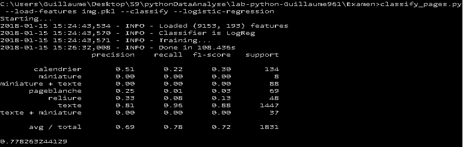
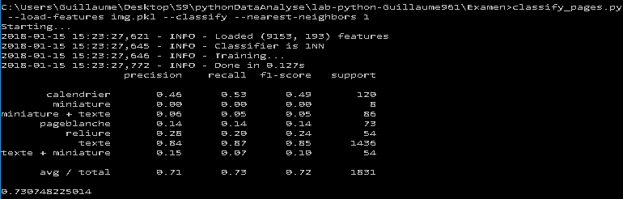
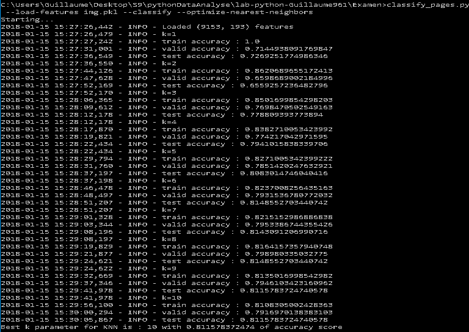

# Reponses examen

Classify pages :

L'objectif est de mettre au point un classifier de page afin de prédire pour chaque page d’un manuscrit son type.
Il faut également pouvoir estimer la performance des classifiers utilisés.

On cherche à faire de la classification sur des livres. Il s'agit d'une technique supervisée. 
On souhaite à associer une image à un label (ici le type de page) en entrainant des classifiers sur des datasets comportants les réponses.

Pour manipuler les images, nous avons besoin de les convertir en vecteurs. Pour ce faire, il faut d'abord réduire l'image pour que les calculs ne prennent pas trop de temps. On constate que nos images ont une dimension rectangulaire, on essaye donc de réduire les images à une taille de 12,16 pour garder les proportions pour le calcul des vecteurs.

Afin de ne pas avoir besoin de regénérer ces vecteurs, on stock ces informations dans un fichier pickle que l'on va lire par la suite.

Pour manipuler les données on utilise un échantillon aléatoire qui permettra d'entrainer nos classifiers et d'estimer les paramètres des algorithmes. En plus de cette partition on crée aussi un ensemble de validation et un ensemble de test.

Les modèles de classifiers utilisés sont la regression logistique et le k-plus proche voisin.

Les résultats trouvés au niveau de la précision des predictions ne sont pas très bons. Entre les differents classfiers et paramètres on trouve entre 0.71 et 0.83 de ratio de bonnes prédictions.

Avec plus de temps, il faudrait essayer des modèles plus complexes tels que SVM ou random forest... toujours en recherchant à minimiser l'erreur de prédiction.

Les commandes utilisées sont : 
```
classify_pages.py --images-list --save-features img.pkl
classify_pages.py --load-features img.pkl
classify_pages.py --load-features img.pkl --classify --logistic-regression
classify_pages.py --load-features img.pkl --classify --optimize-nearest-neighbors
classify_pages.py --load-features img.pkl --classify --nearest-neighbors 1
```

# Quelques résultats console








