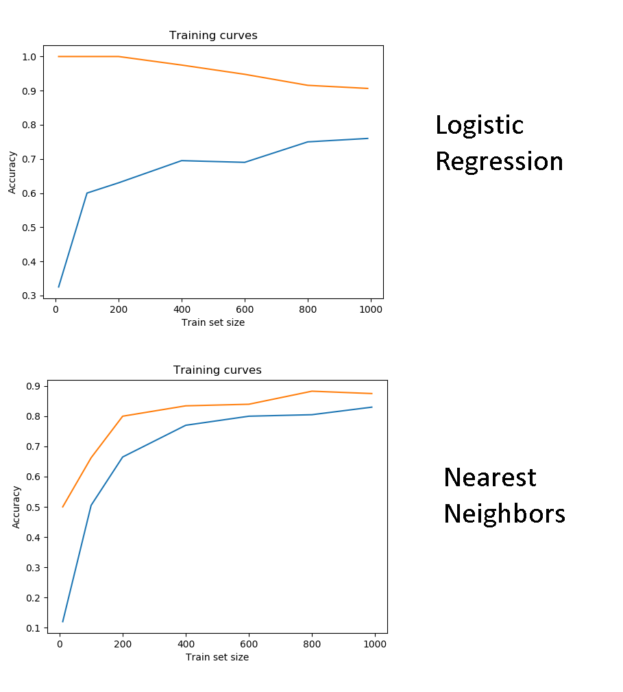
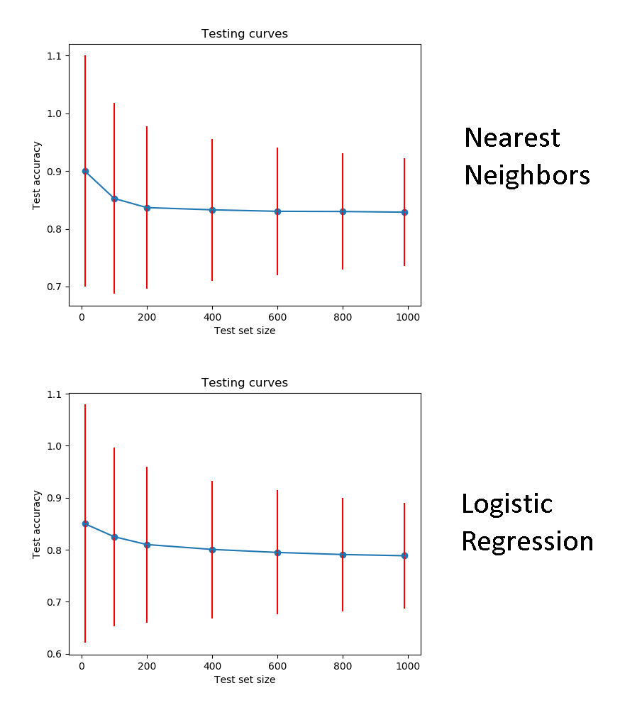

# Question 1 & 2

run command : 
```
save cmd > classify_images.py --images-list MNIST_all.csv --features-only
```

# Question 3

run the save command : 
```
save cmd > classify_images.py --images-list MNIST_all.csv --features-only --save-features ft_save
```
run the load command :
```
load cmd > classify_images.py --load-features ft_save.pickle --features-only
```

# Question 4 & 5

run command : 
```
cmd > classify_images.py --load-features ft_save.pickle --nearest-neighbors 1
```
Accuracy score calculated for k = 1 : 0.923833333333
Accuracy score calculated for k = 2 : 0.919916666667
Accuracy score calculated for k = 3 : 0.933
Accuracy score calculated for k = 4 : 0.93225
Accuracy score calculated for k = 5 : 0.932916666667

# Question 6

run command : 
```
cmd > classify_images.py --load-features ft_save.pickle --nearest-neighbors-logistic-regression
```

Best value for K found is 9 :

Score on training : 0.941484
Score on testing : 0.927708

             precision    recall  f1-score   support

          0       0.96      0.98      0.97       982
          1       0.92      0.98      0.95      1096
          2       0.96      0.95      0.95       967
          3       0.93      0.89      0.91       924
          4       0.94      0.92      0.93       906
          5       0.92      0.92      0.92       888
          6       0.96      0.97      0.97       948
          7       0.91      0.91      0.91       994
          8       0.92      0.85      0.89       916
          9       0.86      0.90      0.88       979

avg / total       0.93      0.93      0.93      9600

Accuracy score : 0.927708333333

The others accuracy values found are :
k = 1 : 0.920208333333
k = 2 : 0.914791666667
k = 3 : 0.925625
k = 4 : 0.924791666667
k = 5 : 0.926145833333
k = 6 : 0.925625
k = 7 : 0.92625
k = 8 : 0.927395833333

# Question 7

run command : 
```
cmd > classify_images.py --load-features ft_save.pickle --logistic-regression 1
```
Logistic Regression's accuracy : 0.864083333333
Comparing to the KNN best accuracy, the logistic regression is has about 0.064 more error.

# Question 8



# Question 10



We see that, as the test set size increases, the standard deviation reduces. 
That means that the estimation is better.

# Question 11

Compared to the other classifiers, SVM is the best for handwritten digit recognition.


